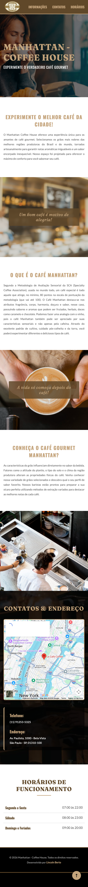

# ☕ MANHATTAN - COFFEE HOUSE

> [!NOTE]
> **Projeto de Portfólio:** Este repositório foi desenvolvido como um projeto prático de avaliação para consolidar os fundamentos de Desenvolvimento Web. O código original passou por um rigoroso processo de refatoração para aplicar as melhores práticas do mercado, como arquitetura modular, semântica avançada e otimização de performance.

Landing page institucional de alto padrão desenvolvida com foco em conversão direta, arquitetura CSS modular e total responsividade para a cafeteria premium **Manhattan - Coffee House**. O sistema aplica conceitos avançados de estruturação semântica, controle de imagens de fundo através de múltiplos blocos com efeito Parallax e navegação interna otimizada.

---

## 📱 Demonstração do Projeto

Confira abaixo o comportamento visual da interface renderizada em diferentes resoluções:

  <table>
    <tr>
      <td align="center" width="60%">
        <b>💻 Versão Desktop</b>  
        
      </td>
      <td align="center" width="40%">
        <b>📱 Versão Mobile</b>  
        
      </td>
    </tr>
  </table>

---

## 🚀 Stack Tecnológica e Conceitos Aplicados

O projeto foi construído utilizando tecnologias fundamentais da web, focando em práticas modernas de arquitetura front-end e boas práticas de engenharia:

- **HTML5 Semântico:** Uso rigoroso de tags como `header`, `section`, `main` e `footer` para garantir a melhor acessibilidade estrutural e otimização para motores de busca (SEO).
- **CSS Modular (Arquitetura Nativa):** Divisão estrita de responsabilidades em arquivos isolados (`variables.css`, `global.css`) unificados através de um arquivo mestre (`main.css`) usando a regra `@import` nativa.
- **Design Tokens:** Centralização de paleta de cores institucional e tipografia (fontes _Fraunces_, _Oswald_ e _Lato_) através de variáveis globais `:root`.
- **Layout Moderno e Híbrido:**
  - **Flexbox:** Aplicado para alinhamentos dinâmicos lado a lado e distribuição matemática de blocos, como no cabeçalho fixo, seções de texto e na área de contatos (mapa e informações).
  - **Efeito Parallax Nativo:** Controle de movimentação tridimensional em múltiplos blocos de imagem utilizando `background-attachment: fixed` com foco em performance visual líquida.
- **Navegação Âncora Avançada:** Sistema de links internos integrados com a propriedade global `scroll-behavior: smooth`, enriquecendo a experiência do usuário durante o deslocamento na página.

## 📝 Funcionalidades em Destaque

- **Topo Fixo Inteligente:** Barra de navegação que acompanha a rolagem do usuário, estruturada através de posicionamento fixo (`position: fixed`) e controle de profundidade de camadas (`z-index`).
- **Geolocalização Integrada:** Incorporação do mapa interativo do Google Maps utilizando carregamento tardio otimizado (`lazy loading`) para mitigar impactos na thread principal do navegador.
- **Botão Flutuante Voltar ao Topo:** Componente dinâmico com posicionamento absoluto em relação ao viewport da página, garantindo o retorno imediato à coordenada zero do site com micro-interação de transição suave (`hover`).
- **Contraste e Acessibilidade:** Uso técnico de pseudo-elementos (`::before`) com camadas de opacidade escura (`rgba`) para garantir o contraste perfeito dos textos por cima de imagens de fundo, atendendo aos critérios da W3C.

## 👨‍💻 Autor

Desenvolvido com dedicação por **Lincoln Berto**.

- **LinkedIn:** [https://www.linkedin.com/in/lincoln-berto/](https://www.linkedin.com/in/lincoln-berto/)
- **GitHub:** [https://github.com/eilincoln](https://github.com/eilincoln)
- **Portfólio:** [https://lincolnberto.com](https://lincolnberto.com)
